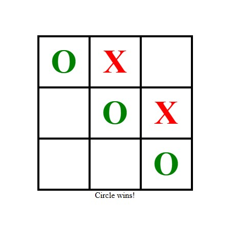
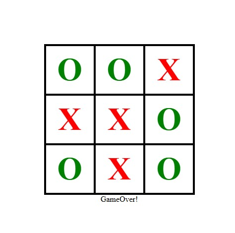

# 🎮 React Tic-Tac-Toe Game

A modern Tic-Tac-Toe game built with Next.js, featuring interactive gameplay, win detection, and responsive design.
## 🎮 Preview




## ✨ Features

- Classic 3x3 Tic-Tac-Toe gameplay
- Real-time win detection (8 possible winning combinations)
- Turn-based system (Circle vs Cross)
- Game over detection (draw/tie)
- Responsive design with clean UI
- Color-coded players (Green O's vs Red X's)
- Built with modern React hooks and TypeScript

## 🚀 Getting Started

1. Clone the repository:
   ```bash
   git clone https://github.com/your-username/tic-tac-toe.git
Install dependencies:

bash
npm install

Run the development server:

bash
npm run dev

Open http://localhost:3000 in your browser to play!

🏗️ Project Structure
/tic-tac-toe
├── app/
│   ├── page.tsx         # Main game component
│   └── globals.css      # Global styles
├── components/
│   └── cell.tsx         # Individual cell component
└── README.md            # You are here
🧠 How It Works
Game Logic: The game checks all 8 possible winning combinations after each move

State Management: Uses React's useState and useEffect hooks

Components:

Cell.tsx: Handles individual cell clicks and rendering

page.tsx: Manages game state and winning logic

🛠️ Built With
Next.js - React framework

TypeScript - Type safety

CSS Modules - Component styling

🤝 Contributing
Contributions are welcome! Please open an issue or submit a pull request.

📜 License
This project is licensed under the MIT License - see the LICENSE file for details.

Made with ❤️ by Mohammad Mesbah 